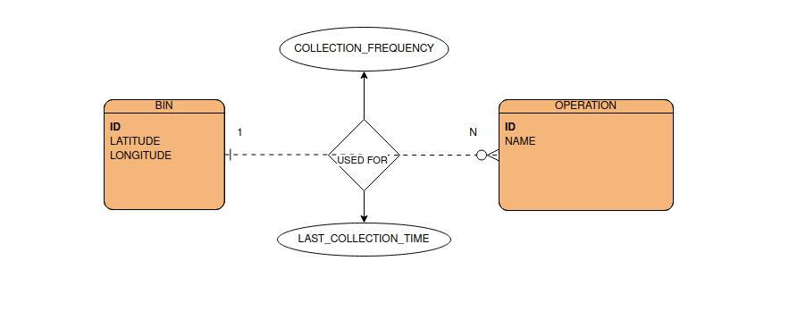

### Q2 Solution

- [x] Model Design

I think that is a one-to-many relationship. So, I added fields collection_frequency and last_collection fields with Bin object field which is related to this operation, to the Operation model.

- [x] Create a function that returns the list of collection_frequency values for all Bin-Operation pairs

You can look at the get_collection_frequency function in the solution/views.py.

- [x] Entity-Relationship Diagram

